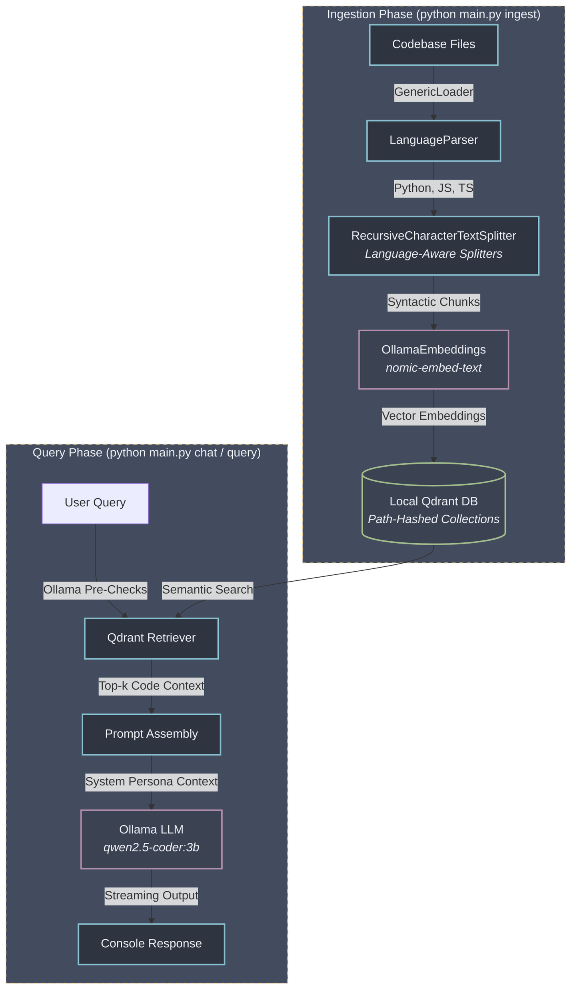

# TermiCursor - Local, Offline Codebase AI Assistant

TermiCursor is an fully offline, command-line AI assistant designed to run Retrieval-Augmented Generation (RAG) over local codebases using local models. It guarantees complete privacy by processing all code files, embeddings, and inference locally on your PC.

---

##  Architecture Overview

TermiCursor divides operations into two distinct workflows: **Ingestion** (populating the vector database) and **Querying** (retrieval-augmented generation).



### 1. Ingestion Phase (`ingest`)
1. **File Scanning:** Uses `GenericLoader` from LangChain to scan code files matching `.py`, `.js`, `.jsx`, `.ts`, and `.tsx`.
2. **Language Parser:** Analyzes documents dynamically and assigns syntax parsing tags (`metadata["language"]`).
3. **Language-Aware Splitting:** Documents are grouped by language, and chunked using syntax-specific token splitting rules (`RecursiveCharacterTextSplitter.from_language`) to ensure functions, class signatures, and control structures remain cohesive.
4. **Vector Database Storage:** Semantic text embeddings are generated using Ollama's `nomic-embed-text` model and indexed into local Qdrant collections.

### 2. Query Phase (`chat` or `query`)
1. **Local Model Pre-Check:** Validates that Ollama is online and all models (`nomic-embed-text` and `qwen2.5-coder:3b`) are fully pulled before initializing.
2. **Path-Hashed DB Isolation:** Automatically hashes the absolute project directory to resolve and load a unique, project-specific database collection. This guarantees absolute workspace isolation (no collisions).
3. **Retrieval:** Uses Qdrant's vector search to retrieve the top-3 most semantically similar codebase chunks corresponding to the user's question.
4. **LLM Generation:** Combines the prompt, retrieved code chunks, and system persona instructions, passing them to the local `qwen2.5-coder:3b` model to generate clean, highly precise answers.

---

##  Features

*   **Complete Privacy:** 100% offline. No code or metadata leaves your host machine.
*   **Syntax-Aware Parsing:** Code-aware chunking ensures logical components (functions, classes) are kept intact.
*   **Database Workspace Isolation:** Every project folder receives a unique path-hashed Qdrant collection to completely avoid data mix-ups.
*   **Proactive Checks:** Validates model availability and connectivity to prevent standard connection tracebacks.
*   **Windows Terminal Safe:** Integrated UTF-8 reconfiguration protects against command-line character rendering crashes.

---

##  How to Run

### Command Options
Ensure you are using the virtual environment containing the dependencies (`langchain`, `qdrant-client`, `langchain-ollama`).

```powershell
# 1. Create a venv
python -m venv .venv

# 2. Activate the virtual environment
..\..\.venv\Scripts\Activate.ps1

# 3. Install requirement file
pip install requirements.txt

# 4. Install frontend files
cd termicursor-ui
npm install

# 5. Open 2 terminal and navigate one to backend & frontend
cd termicursor-ui
npm run dev

# Open another terminal and run 
cd Cursor
uvicorn main:app --reload

# 5. Ingest (Index) the current directory codebase
python main.py ingest .

# 6. Ask a single-shot question
python main.py query . "Explain the validate_ollama_status function."

# 7. Launch the interactive prompt session
python main.py chat .
```
