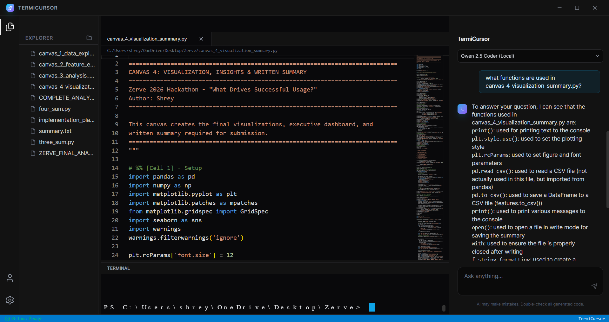
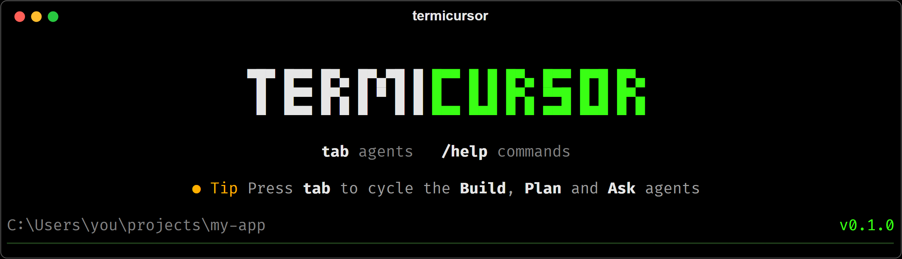
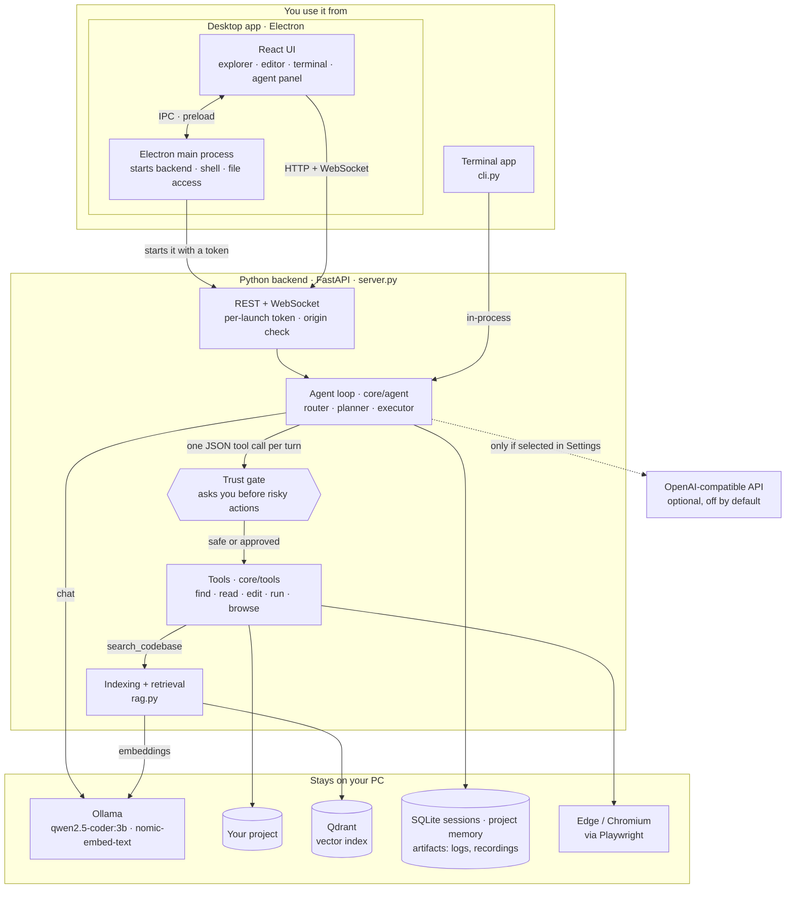
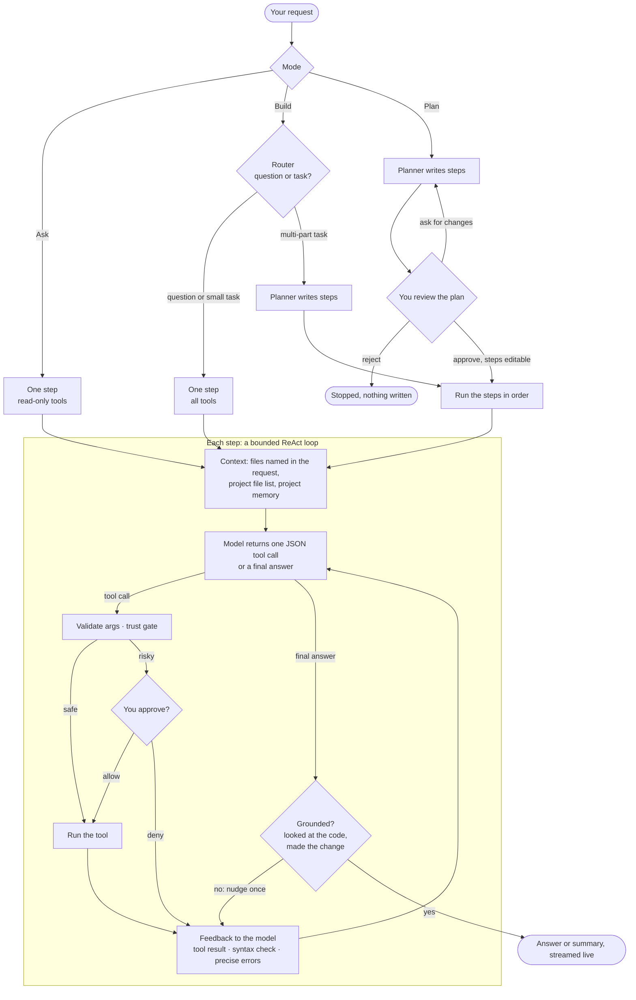
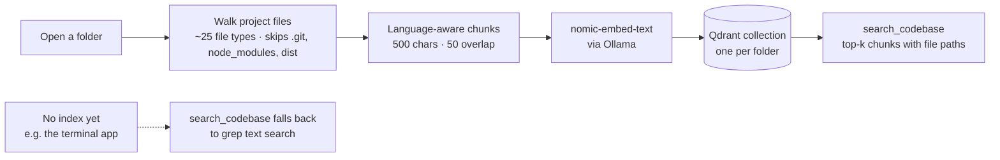

# TermiCursor - Local Agentic Coding Assistant

TermiCursor is a GUI-based AI coding **agent** that runs on local models. Give it a
goal: it plans the work (for anything non-trivial), then edits files, searches your
codebase, and runs shell commands to accomplish it. It asks for your approval before
running commands and streams its plan, thoughts and results live. Three modes: **Ask**
(answers questions, read-only), **Plan** (you review the plan before any code is
written) and **Build** (plans if needed, then codes). With the default Ollama setup,
your code, embeddings and inference stay on your PC.

# GUI Look


# Terminal Look


## 🚀 Download

**[Download the latest Windows installer](https://github.com/MShreyash09/TermiCursor/releases/latest)**

1. Install [Ollama](https://ollama.com/download) and make sure it's running.
2. Install and open TermiCursor. The status bar turns green and shows **ready** with the
   model name once it can reach Ollama.
3. If it shows **Models missing**, click **Install** in the status bar (or the download
   link on the welcome screen). The default models (`qwen2.5-coder:3b` and
   `nomic-embed-text`) are about 2.2 GB in total.
4. Open a project folder and give the agent a task.

Requirements: Windows 10/11 and 8 GB RAM recommended. The browser tools use the Microsoft Edge that
comes with Windows.

### What goes over the network
- Checking GitHub for TermiCursor updates.
- Downloading models through Ollama (only when you click Install).
- Web pages the agent opens with its browser tools.
- **Cloud models (optional):** if you add and choose an OpenAI-compatible provider (Groq, Gemini, OpenAI…) in
  Settings, your prompts and the code the agent reads are sent to that provider.

### Safety
- The agent asks before **every** shell command and before deleting files or writing outside
  the project. Settings → *Auto-approve shell commands* skips the prompt, except for destructive
  commands (`rm`, `del`, `git reset --hard`…), which always ask.
- The app's local backend only accepts requests carrying a secret generated at each launch,
  so other programs and web pages can't drive the agent.
- Logs for bug reports: `%APPDATA%\Termicursor\logs\main.log`. See [SECURITY.md](SECURITY.md)
  to report a vulnerability.

---

## Architecture

TermiCursor has two front ends, the **desktop app** and the **terminal app**, over one
Python agent core (`core/`). The desktop app starts a local FastAPI backend and talks to it
over HTTP and a WebSocket; the terminal app runs the same agent in-process. Models run in
Ollama on your PC unless you opt into a cloud provider.

### System overview



| Part | Where | What it does |
|---|---|---|
| Desktop app | `frontend/` (Electron, React, Vite, Tailwind) | Editor (Monaco), file tree, terminal (xterm.js), agent panel. The main process starts the packaged backend with a per-launch token and guards navigation. |
| Terminal app | `cli.py` (`termicursor`), `main.py` (headless) | Same agent, in the terminal. `tab` cycles Ask / Plan / Build. |
| Backend | `server.py` (FastAPI) | Sessions, plan review, approvals, artifacts, model downloads; streams agent events over `WS /ws/agent/{session_id}`. |
| Agent | `core/agent/` | `loop.py` runs requests; `router.py` (simple vs multi-step), `planner.py`, `context.py` (grounding), `prompts.py`, `json_protocol.py`, `llm_client.py` (Ollama or OpenAI-compatible). |
| Tools | `core/tools/` | `grep`, `find_files`, `list_dir`, `read_file`, `search_codebase`, `edit_file`, `write_file`, `delete_file`, `run_shell_command`, browser tools; `trust_gate.py` decides what needs approval. |
| Retrieval | `rag.py` | Indexes a folder into a local Qdrant collection and serves semantic search. |
| Storage | `core/persistence`, `core/memory`, `core/artifacts` | SQLite sessions and tool calls, per-folder project memory (JSON), command logs and browser recordings. |
| Settings | `core/config.py` | Reads `settings.json` on each run, so changes apply without a restart. |

### How a request runs



1. **Route.** Ask answers directly with read-only tools. Plan always writes a plan and waits
   for you to approve, edit or revise it. Build lets `core/agent/router.py` decide: questions
   and small tasks run as one step, multi-part tasks get a plan first. Heuristics resolve most
   cases without an LLM call.
2. **Execute.** Each step is a bounded ReAct loop: the model emits one JSON tool call per turn,
   which is validated against the tool's schema, checked by the trust gate, run, and fed back,
   until it returns a final answer. The tools follow how Cursor and Claude Code work:
   - find: `grep` (exact text or regex, with context lines), `find_files` (glob), `list_dir`,
     `search_codebase` (semantic; falls back to text search when the project isn't indexed)
   - read: `read_file` (numbered lines, 200-line pages)
   - change: `edit_file` (exact `old_string` → `new_string`, must match once; an empty
     `old_string` appends), `write_file` (new files), `delete_file`
   - run and verify: `run_shell_command`, `browser_navigate` / `browser_click` / `browser_get_text`
3. **Grounding** (`core/agent/context.py`, `loop.py`), so a small model looks instead of
   guessing: files named in the request are read up front (like an @-mention); the prompt
   includes the project's file list; a project question answered without looking gets one
   nudge, and so does a change request that ends without an edit. `write_file` over an unread
   file, or one that would erase most of it, is refused. Edits keep the file's line endings and
   report a syntax check.
4. **Trust gate.** Every shell command (unless auto-approve is on; destructive ones always),
   deletes, and writes outside the project pause for your approval.
5. **Stream and stop.** Every step streams live over the WebSocket, and a run can be stopped at
   any time (`POST /sessions/{id}/cancel`).
6. **Browser checks (text only).** qwen2.5-coder:3b can't see images, so the browser tools
   return page text and console/network errors, never pixels. Separately, and only for you, the
   whole browser session is recorded to a `.webm` that appears in the Artifacts list.

### Indexing and search



When you open a folder (Settings → *Index project on open*), `rag.py` walks the project,
splits each file with LangChain's language-aware splitter so functions and classes stay
together, embeds the chunks with `nomic-embed-text`, and stores them in a local Qdrant
collection named after the folder's path hash, so projects never mix. Reopening a folder
reuses its index. Exact-match search (`grep`) works without any index.

### Skills and MCP servers (connectors)

**Skills** are instruction packs, one folder each with a `SKILL.md`:

```
<project>/.termicursor/skills/<name>/SKILL.md      (this project only)
<app data>/skills/<name>/SKILL.md                  (all projects)
```

```markdown
---
name: api-style
description: How this repo writes FastAPI endpoints
---
Use pydantic request models, return dicts, ...
```

**MCP servers** go in `settings.json` under `mcpServers`, in the same format Claude Desktop uses.
Each entry is either a command (stdio) or a `url` (streamable HTTP):

```json
"mcpServers": {
  "github": {"command": "npx", "args": ["-y", "@modelcontextprotocol/server-github"],
             "env": {"GITHUB_PERSONAL_ACCESS_TOKEN": "..."}},
  "docs":   {"url": "https://example.com/mcp"}
}
```

Only skill names, skill descriptions and server names go in the prompt. The agent reads a
skill's text with `load_skill`, finds an MCP tool with `mcp_find`, and runs it with
`mcp_call`, which asks for your approval first. So adding more skills or servers barely
grows the prompt. Tool results do take context, so set `OLLAMA_NUM_CTX` to 16384–32768
when you use MCP. Multi-step skill/MCP work needs a model of about 14B parameters or more
(for example `qwen2.5-coder:14b` or `devstral`). 3B models manage basic file edits only.

---

##  Features

*   **Private by Default:** With Ollama, code, embeddings and inference stay on your machine (see *What goes over the network* above).
*   **Syntax-Aware Parsing:** Code-aware chunking ensures logical components (functions, classes) are kept intact.
*   **Database Workspace Isolation:** Every project folder receives a unique path-hashed Qdrant collection to completely avoid data mix-ups.
*   **Proactive Checks:** Validates model availability and connectivity to prevent standard connection tracebacks.
*   **Windows Terminal Safe:** Integrated UTF-8 reconfiguration protects against command-line character rendering crashes.

---

##  Development

### Command Options
Requires Python 3.10+ (releases are built with 3.13) and Node 22. Dependencies are pinned in `requirements.txt`.

```powershell
# 1. Create a venv
python -m venv .venv

# 2. Activate the virtual environment
.venv\Scripts\activate

# 3. Install requirement file
pip install -r requirements.txt

# 3b. One-time: install the Chromium binary the browser tools drive
python -m playwright install chromium

# 4. Install frontend files
cd frontend
npm install

# 5. Open 2 terminals: one for frontend, one for backend
cd frontend
npm run dev

# Open another terminal and run
uvicorn server:app --reload

# 6. Ingest (Index) the current directory codebase
python main.py ingest .

# 7. Run the agent on a goal (headless CLI; anything needing approval is auto-denied,
#    including shell commands unless "autoApproveShell": true is in settings.json)
python main.py run . "Create a Flask hello-world app and run it"

# 8. Interactive terminal UI (asks you before running commands)
python cli.py

# Tests (offline; tests/live_* need a running Ollama)
python -m pytest -q tests --ignore-glob="tests/live_*"

# Agent eval against your Ollama: does it use its tools and get the right answer?
python tests/live_agent_eval.py            # 11 tasks x 2 reps, prints a pass table

# End-to-end GUI test: drives the real Electron app (own backend + Vite on free ports)
cd frontend && node e2e/run-e2e.mjs        # screenshots in frontend/e2e/screenshots
```

In dev, the backend runs without the per-launch token (only the packaged app sets
`TERMICURSOR_TOKEN`); it still rejects requests from any origin except the Vite dev server.

The GUI (`npm run dev` in `frontend/`) is the primary way to use the agent — it shows
the live plan, tool calls, approval prompts, and artifacts, and lets you stop a run
mid-flight.

---

## References

Official documentation and sources used or referenced to build TermiCursor.

### Models and local inference
- [Ollama](https://ollama.com) and the [Ollama API docs](https://docs.ollama.com/api): local model runtime (`/api/chat`, `/api/tags`, `/api/pull`)
- [qwen2.5-coder on Ollama](https://ollama.com/library/qwen2.5-coder) and the [Qwen2.5-Coder Technical Report](https://arxiv.org/abs/2409.12186): the default agent model
- [nomic-embed-text on Ollama](https://ollama.com/library/nomic-embed-text): the embedding model
- [Groq OpenAI compatibility](https://console.groq.com/docs/openai): the OpenAI-compatible request format used for API providers

### Agent design
- [ReAct: Synergizing Reasoning and Acting in Language Models](https://arxiv.org/abs/2210.03629): the reason → act → observe loop each step runs
- [Retrieval-Augmented Generation for Knowledge-Intensive NLP Tasks](https://arxiv.org/abs/2005.11401): the idea behind codebase retrieval
- [Cursor: Agent overview](https://cursor.com/docs/agent/overview) and [Cursor: Search](https://cursor.com/docs/agent/tools/search): exact search first, semantic search second
- [Claude Code: Tools reference](https://code.claude.com/docs/en/tools-reference): Read / Edit / Grep / Glob design (numbered paged reads, exact-match edits that must be unique)
- [aider: Edit formats](https://aider.chat/docs/more/edit-formats.html) and [aider: Repository map](https://aider.chat/docs/repomap.html): search/replace edits and giving the model a map of the repo
- [Google Antigravity: Implementation Plan](https://antigravity.google/docs/implementation-plan) and [Build with Google Antigravity](https://developers.googleblog.com/build-with-google-antigravity-our-new-agentic-development-platform/): plan-first mode with a reviewable plan
- [opencode](https://opencode.ai): inspiration for the terminal UI

### Backend and retrieval
- [FastAPI](https://fastapi.tiangolo.com/), [Uvicorn](https://uvicorn.dev/), [Pydantic](https://docs.pydantic.dev/), [aiohttp](https://docs.aiohttp.org/)
- [LangChain](https://docs.langchain.com/oss/python/langchain/overview), [LangChain text splitters](https://docs.langchain.com/oss/python/integrations/splitters), [LangChain + Ollama](https://docs.langchain.com/oss/python/integrations/providers/ollama)
- [Qdrant documentation](https://qdrant.tech/documentation/) and the [Qdrant Python client](https://github.com/qdrant/qdrant-client) (local mode)
- [sqlite3 (Python)](https://docs.python.org/3/library/sqlite3.html)
- [Playwright for Python](https://playwright.dev/python/): browser tools and recordings
- [PyInstaller](https://pyinstaller.org/): packages the backend into an executable

### Terminal app
- [Rich](https://rich.readthedocs.io/), [prompt_toolkit](https://python-prompt-toolkit.readthedocs.io/), [questionary](https://questionary.readthedocs.io/)

### Desktop app
- [Electron](https://www.electronjs.org/docs/latest/) and the [Electron security checklist](https://www.electronjs.org/docs/latest/tutorial/security)
- [electron-builder](https://www.electron.build/) (installer; its [repository](https://github.com/electron-userland/electron-builder) includes electron-updater) and [electron-log](https://github.com/megahertz/electron-log)
- [React](https://react.dev/), [Vite](https://vite.dev/), [Tailwind CSS](https://tailwindcss.com/), [TypeScript](https://www.typescriptlang.org/)
- [Monaco Editor](https://microsoft.github.io/monaco-editor/) and [@monaco-editor/react](https://github.com/suren-atoyan/monaco-react)
- [xterm.js](https://xtermjs.org/), [react-resizable-panels](https://github.com/bvaughn/react-resizable-panels), [cmdk](https://github.com/dip/cmdk), [Lucide icons](https://lucide.dev/), [react-markdown](https://github.com/remarkjs/react-markdown)
- [Playwright Electron API](https://playwright.dev/docs/api/class-electron): the end-to-end GUI test
- [Mermaid](https://mermaid.js.org/): the diagrams in this README

## License

[MIT](LICENSE)
